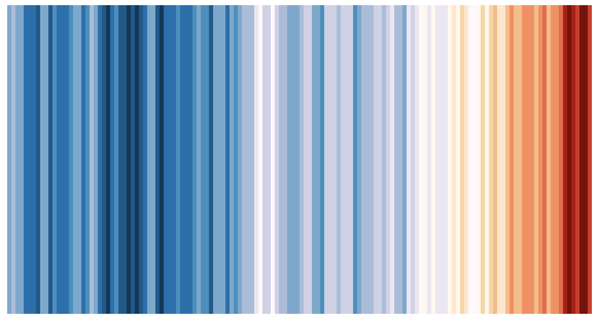

# WARMING STRIPES	1880-2021

This is showing the temperature anomaly from the averaged monthly global (land and sea-surface temperatures) 30-year-mean from 1951-1980.

This is a data visualization project based off of [Ed Hawkins](https://twitter.com/ed_hawkins)' original presentation.  My goal is to learn some [D3](https://d3js.org). I'm following a tutorial from v5. 

Data is from [NASA's](https://data.giss.nasa.gov/gistemp/) Combined Land-Surface Air and Sea-Surface Water Temperature Anomalies (Land-Ocean Temperature Index, L-OTI), with the  base period: 1951-1980. That is, these monthly deviations are from the corresponding 1951-1980 means. (sources:  GHCN-v4 1880-12/2021 + SST: ERSST v5 1880-12/2021
using elimination of outliers and homogeneity adjustment)

The Colors were for the scale approximated from https://colorbrewer2.org, with the deepest blue being the lowest anomaly, and the deepest orange being the warmest anomaly. 

The min and max for the anomalies are found, and used as a range for the colorbar. We have 18 colors to map over -0.48 to 1.02, so the middle point isn't the palest color.

I plan on adding a color bar legend at some point.
